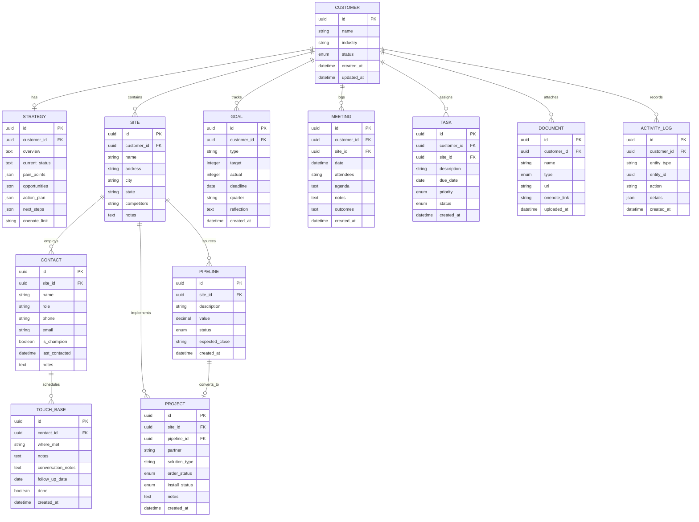

# feat: Account Planning CRM - MVP Implementation Plan

## Overview

**Project**: Account Planning CRM
**Type**: Enhancement - New Application
**Priority**: High
**Complexity**: Medium (12 entities, 8 views, web-only MVP)
**Timeline**: 3 weeks

### Executive Summary

Build a personal CRM and Account Planning System for managing B2B customer relationships, multi-site accounts, sales pipeline, strategic planning, project tracking, and follow-up activities. The application will feature a modern UI inspired by monday.com's color palette with light/dark mode toggle.

### User Requirements (Gathered)

| Requirement | Decision |
|-------------|----------|
| Timeline | 2-3 weeks |
| Data scale | 10-50 customers |
| Features | All 11 core features |
| Tech stack | Next.js (simplified from Vite + Express) |
| Auth | Full login (email/password with sessions) |
| Design | Custom monday.com style |
| Platforms | Web-only (desktop/mobile deferred) |

---

## Problem Statement

Sales professionals managing B2B accounts need a unified system to:
- Track customers with multiple physical sites and contacts
- Manage sales pipeline opportunities through stages
- Monitor project implementations
- Set and track quarterly KPIs
- Schedule and complete follow-ups
- Generate quarterly reports

Current solutions are either too complex (enterprise CRMs) or too simple (spreadsheets), lacking the specific account planning focus needed for strategic B2B relationship management.

---

## Proposed Solution

A full-stack web application with:
- **Framework**: Next.js 14+ with App Router and Server Actions
- **Styling**: Tailwind CSS with monday.com-inspired design system
- **Database**: SQLite via Prisma ORM (simple, no server needed)
- **Auth**: NextAuth.js with credentials provider
- **Deployment**: Vercel (one-click deploy)

---

## Technical Approach

### Architecture

```
┌─────────────────────────────────────────────────────────────┐
│                     Next.js App Router                       │
│   React Server Components + Server Actions                   │
│   Tailwind CSS + monday.com Design System                   │
│   Light/Dark Mode Toggle                                     │
└─────────────────────────────────────────────────────────────┘
                              │
                              ▼
┌─────────────────────────────────────────────────────────────┐
│                      Prisma ORM                              │
│   Type-safe queries + Server Actions                        │
│   Zod validation + DTOs                                     │
└─────────────────────────────────────────────────────────────┘
                              │
                              ▼
┌─────────────────────────────────────────────────────────────┐
│                         SQLite                               │
│   12 Core Entities + Full Relationship Graph                │
│   File-based, no server needed                              │
└─────────────────────────────────────────────────────────────┘
```

### Project Structure

```
mycrm/
├── app/                          # Next.js App Router
│   ├── (auth)/                   # Auth routes (login, register)
│   │   ├── login/page.tsx
│   │   └── register/page.tsx
│   ├── (dashboard)/              # Protected routes
│   │   ├── layout.tsx            # App shell with sidebar
│   │   ├── page.tsx              # Dashboard home
│   │   ├── customers/
│   │   │   ├── page.tsx          # Customer list
│   │   │   ├── new/page.tsx      # Create customer
│   │   │   └── [id]/
│   │   │       ├── page.tsx      # Customer detail
│   │   │       └── strategy/page.tsx
│   │   ├── pipeline/page.tsx
│   │   ├── projects/page.tsx
│   │   ├── follow-ups/page.tsx
│   │   ├── goals/page.tsx
│   │   ├── tasks/page.tsx
│   │   └── reports/page.tsx
│   ├── api/                      # API routes (if needed)
│   │   └── auth/[...nextauth]/route.ts
│   ├── layout.tsx                # Root layout
│   └── globals.css               # Global styles
│
├── components/
│   ├── ui/                       # Base UI (Button, Card, Input, etc.)
│   ├── layout/                   # Sidebar, Header, AppShell
│   ├── customers/                # Customer-specific components
│   ├── pipeline/                 # Pipeline components
│   ├── charts/                   # Chart components
│   └── forms/                    # Form components
│
├── lib/
│   ├── actions/                  # Server Actions
│   │   ├── customers.ts
│   │   ├── pipeline.ts
│   │   └── ...
│   ├── db.ts                     # Prisma client
│   ├── auth.ts                   # NextAuth config
│   ├── validations/              # Zod schemas
│   └── utils.ts
│
├── prisma/
│   ├── schema.prisma
│   ├── migrations/
│   └── seed.ts
│
├── types/                        # TypeScript types & DTOs
│   ├── entities.ts
│   └── api.ts
│
├── public/
└── package.json
```

### Why Next.js Over Vite + Express

| Benefit | Impact |
|---------|--------|
| No separate API server | 50% less code to write |
| Server Actions | Type-safe mutations without REST |
| Built-in routing | No React Router setup |
| Server Components | Faster page loads, less client JS |
| Vercel deployment | One-click deploy, zero config |
| NextAuth.js | Auth solved in hours, not days |

### Design System

**Color Palette** (monday.com-inspired):
```css
/* Primary Colors */
--color-primary-900: #0F1048;    /* Deep navy - backgrounds */
--color-primary-800: #0b0b4a;    /* Dark blue - sidebar */
--color-primary-600: #5034FF;    /* Vibrant purple - accents */
--color-primary-500: #6161FF;    /* Lighter purple - hover */

/* Neutral Colors */
--color-neutral-50: #F5F6F8;     /* Light gray - backgrounds */
--color-neutral-100: #ffffff;    /* White - cards */

/* Status Colors */
--color-success: #00C875;        /* Green - completed */
--color-warning: #FDAB3D;        /* Orange - at risk */
--color-danger: #E2445C;         /* Red - overdue */
--color-info: #00D2D2;           /* Cyan - info */
```

**Typography** (Poppins):
```css
font-family: 'Poppins', sans-serif;
font-weights: 300 (light), 400 (regular), 500 (medium), 600 (semibold), 700 (bold);
```

**Dark Mode Implementation**:
- Tailwind `darkMode: 'selector'` strategy
- localStorage persistence
- System preference detection fallback
- Toggle in header navigation

---

## Data Model

### Entity Relationship Diagram



### Prisma Schema

```prisma
// prisma/schema.prisma

generator client {
  provider = "prisma-client-js"
}

datasource db {
  provider = "sqlite" // Change to "postgresql" for production
  url      = env("DATABASE_URL")
}

enum CustomerStatus {
  ACTIVE
  INACTIVE
  PROSPECT
  ARCHIVED
}

enum PipelineStatus {
  OPEN
  CLOSING_SOON
  CLOSED_WON
  CLOSED_LOST
}

enum OrderStatus {
  NOT_ORDERED
  ORDERED
  PARTIAL
  COMPLETE
}

enum InstallStatus {
  NOT_STARTED
  IN_PROGRESS
  COMPLETE
}

enum TaskPriority {
  LOW
  MEDIUM
  HIGH
  URGENT
}

enum TaskStatus {
  PENDING
  IN_PROGRESS
  DONE
}

enum DocumentType {
  LINK
  UPLOAD
  ONENOTE
}

model Customer {
  id          String          @id @default(uuid())
  name        String
  industry    String?
  status      CustomerStatus  @default(ACTIVE)
  createdAt   DateTime        @default(now())
  updatedAt   DateTime        @updatedAt

  strategy    Strategy?
  sites       Site[]
  goals       Goal[]
  meetings    Meeting[]
  tasks       Task[]
  documents   Document[]
  activities  ActivityLog[]

  @@index([name])
  @@index([status])
}

model Strategy {
  id             String   @id @default(uuid())
  customerId     String   @unique
  overview       String?
  currentStatus  String?
  painPoints     Json?    // Array of { title, description }
  opportunities  Json?    // Array of { title, description }
  actionPlan     Json?    // Array of { initiative, tasks[] }
  nextSteps      Json?    // Array of { step, dueDate }
  onenoteLink    String?
  updatedAt      DateTime @updatedAt

  customer       Customer @relation(fields: [customerId], references: [id], onDelete: Cascade)
}

model Site {
  id          String    @id @default(uuid())
  customerId  String
  name        String
  address     String?
  city        String?
  state       String?
  competitors String?
  notes       String?
  createdAt   DateTime  @default(now())
  updatedAt   DateTime  @updatedAt

  customer    Customer  @relation(fields: [customerId], references: [id], onDelete: Cascade)
  contacts    Contact[]
  pipelines   Pipeline[]
  projects    Project[]
  meetings    Meeting[]
  tasks       Task[]

  @@index([customerId])
}

model Contact {
  id             String      @id @default(uuid())
  siteId         String
  name           String
  role           String?
  phone          String?
  email          String?
  isChampion     Boolean     @default(false)
  lastContacted  DateTime?
  notes          String?
  createdAt      DateTime    @default(now())
  updatedAt      DateTime    @updatedAt

  site           Site        @relation(fields: [siteId], references: [id], onDelete: Cascade)
  touchBases     TouchBase[]

  @@index([siteId])
  @@index([name])
}

model TouchBase {
  id                String    @id @default(uuid())
  contactId         String
  whereMet          String?
  notes             String?
  conversationNotes String?
  followUpDate      DateTime?
  done              Boolean   @default(false)
  createdAt         DateTime  @default(now())

  contact           Contact   @relation(fields: [contactId], references: [id], onDelete: Cascade)

  @@index([contactId])
  @@index([followUpDate])
  @@index([done])
}

model Pipeline {
  id             String          @id @default(uuid())
  siteId         String
  description    String
  value          Decimal         @default(0)
  status         PipelineStatus  @default(OPEN)
  expectedClose  String?         // "Q3 2025", "Q4/Q1"
  createdAt      DateTime        @default(now())
  updatedAt      DateTime        @updatedAt

  site           Site            @relation(fields: [siteId], references: [id], onDelete: Cascade)
  project        Project?

  @@index([siteId])
  @@index([status])
}

model Project {
  id            String        @id @default(uuid())
  siteId        String
  pipelineId    String?       @unique
  partner       String?
  solutionType  String?
  orderStatus   OrderStatus   @default(NOT_ORDERED)
  installStatus InstallStatus @default(NOT_STARTED)
  notes         String?
  createdAt     DateTime      @default(now())
  updatedAt     DateTime      @updatedAt

  site          Site          @relation(fields: [siteId], references: [id], onDelete: Cascade)
  pipeline      Pipeline?     @relation(fields: [pipelineId], references: [id])

  @@index([siteId])
  @@index([orderStatus])
  @@index([installStatus])
}

model Goal {
  id          String    @id @default(uuid())
  customerId  String?
  type        String    // "Quarterly Contacts", "Revenue Target"
  target      Int
  actual      Int       @default(0)
  quarter     String    // "Q3 2025"
  deadline    DateTime?
  reflection  String?
  createdAt   DateTime  @default(now())
  updatedAt   DateTime  @updatedAt

  customer    Customer? @relation(fields: [customerId], references: [id], onDelete: Cascade)

  @@index([customerId])
  @@index([quarter])
}

model Meeting {
  id          String    @id @default(uuid())
  customerId  String
  siteId      String?
  date        DateTime
  attendees   String?
  agenda      String?
  notes       String?
  outcomes    String?
  createdAt   DateTime  @default(now())

  customer    Customer  @relation(fields: [customerId], references: [id], onDelete: Cascade)
  site        Site?     @relation(fields: [siteId], references: [id])

  @@index([customerId])
  @@index([date])
}

model Task {
  id          String       @id @default(uuid())
  customerId  String?
  siteId      String?
  description String
  dueDate     DateTime?
  priority    TaskPriority @default(MEDIUM)
  status      TaskStatus   @default(PENDING)
  createdAt   DateTime     @default(now())
  updatedAt   DateTime     @updatedAt

  customer    Customer?    @relation(fields: [customerId], references: [id], onDelete: Cascade)
  site        Site?        @relation(fields: [siteId], references: [id])

  @@index([customerId])
  @@index([dueDate])
  @@index([status])
}

model ActivityLog {
  id          String    @id @default(uuid())
  customerId  String?
  entityType  String    // "Contact", "Pipeline", "Project"
  entityId    String
  action      String    // "CREATED", "UPDATED", "DELETED"
  details     Json?     // { before, after, changedFields }
  createdAt   DateTime  @default(now())

  customer    Customer? @relation(fields: [customerId], references: [id], onDelete: SetNull)

  @@index([customerId])
  @@index([entityType, entityId])
  @@index([createdAt])
}

model Document {
  id          String       @id @default(uuid())
  customerId  String
  name        String
  type        DocumentType @default(LINK)
  url         String?
  onenoteLink String?
  uploadedAt  DateTime     @default(now())

  customer    Customer     @relation(fields: [customerId], references: [id], onDelete: Cascade)

  @@index([customerId])
}
```

---

## Implementation Phases

### 3-Week Sprint Plan

**Approach**: Build all 11 features in their simplest functional form, then enhance. Ship working software every day.

---

### Week 1: Foundation + Core Entities (Days 1-5)

**Goal**: Working app with auth, customers, sites, contacts, and basic navigation

#### Day 1: Project Setup
- [ ] Initialize Next.js 14 with TypeScript
- [ ] Configure Tailwind CSS with monday.com colors
- [ ] Set up Prisma with SQLite
- [ ] Create full database schema (all 12 entities)
- [ ] Run initial migration + seed data
- [ ] Deploy to Vercel (empty shell)

```bash
npx create-next-app@latest mycrm --typescript --tailwind --app
cd mycrm && npm install prisma @prisma/client
npx prisma init --datasource-provider sqlite
```

#### Day 2: Auth + App Shell
- [ ] Install and configure NextAuth.js (credentials provider)
- [ ] Create login/register pages
- [ ] Build app shell layout (sidebar, header)
- [ ] Implement dark mode toggle
- [ ] Create base UI components (Button, Card, Input, Select)
- [ ] Add Poppins font

```
app/(auth)/login/page.tsx
app/(auth)/register/page.tsx
app/(dashboard)/layout.tsx
components/ui/Button.tsx, Card.tsx, Input.tsx
```

#### Day 3: Customer Module
- [ ] Customer list page with table (sortable, filterable)
- [ ] Customer create/edit form with validation
- [ ] Customer detail page (overview layout)
- [ ] Server Actions for Customer CRUD
- [ ] Soft delete implementation

```
app/(dashboard)/customers/page.tsx
app/(dashboard)/customers/new/page.tsx
app/(dashboard)/customers/[id]/page.tsx
lib/actions/customers.ts
```

#### Day 4: Sites + Contacts
- [ ] Site list under Customer detail
- [ ] Site create/edit inline or modal
- [ ] Contact list under Site
- [ ] Contact create/edit form
- [ ] Server Actions for Site/Contact CRUD
- [ ] "Champion" badge for key contacts

```
components/customers/SiteList.tsx
components/customers/ContactList.tsx
lib/actions/sites.ts
lib/actions/contacts.ts
```

#### Day 5: Dashboard + Navigation
- [ ] Dashboard home page with widgets
- [ ] Customer count, pipeline value, overdue follow-ups
- [ ] Recent activity feed (simple list)
- [ ] Quick action buttons
- [ ] Polish navigation and breadcrumbs

```
app/(dashboard)/page.tsx
components/dashboard/StatsCards.tsx
components/dashboard/ActivityFeed.tsx
```

**Week 1 Deliverable**: Login, create customers with sites/contacts, basic dashboard

---

### Week 2: CRM Features (Days 6-10)

**Goal**: Pipeline, projects, follow-ups, tasks, meetings

#### Day 6: Pipeline Management
- [ ] Pipeline list page with status columns
- [ ] Pipeline create/edit form (site, value, stage, expected close)
- [ ] Status change dropdown (no drag-drop yet)
- [ ] Pipeline value totals by stage
- [ ] Server Actions for Pipeline CRUD

```
app/(dashboard)/pipeline/page.tsx
components/pipeline/PipelineTable.tsx
components/pipeline/StatusBadge.tsx
lib/actions/pipeline.ts
```

#### Day 7: Projects + Pipeline Conversion
- [ ] Project list page with status board (table view)
- [ ] Project create/edit form
- [ ] Order status + Install status dropdowns
- [ ] "Convert to Project" button on won Pipeline
- [ ] Server Actions for Project CRUD

```
app/(dashboard)/projects/page.tsx
components/projects/ProjectTable.tsx
lib/actions/projects.ts
```

#### Day 8: Follow-ups (TouchBase)
- [ ] Follow-up queue page with tabs (Overdue/Today/Upcoming)
- [ ] TouchBase create/edit form
- [ ] Mark complete action
- [ ] Link to contact
- [ ] Color-coded overdue highlighting

```
app/(dashboard)/follow-ups/page.tsx
components/followups/FollowUpQueue.tsx
lib/actions/touchbase.ts
```

#### Day 9: Tasks + Meetings
- [ ] Task list page with filters (status, priority)
- [ ] Task create/edit form with due date
- [ ] Meeting list page by customer
- [ ] Meeting create/edit form (attendees, agenda, notes, outcomes)
- [ ] Server Actions for both

```
app/(dashboard)/tasks/page.tsx
components/customers/MeetingList.tsx
lib/actions/tasks.ts
lib/actions/meetings.ts
```

#### Day 10: Activity Logging
- [ ] Auto-log all create/update/delete actions
- [ ] Activity feed on Customer detail page
- [ ] Activity feed on Dashboard
- [ ] Filterable by entity type

```
lib/actions/activity.ts (middleware pattern)
components/shared/ActivityTimeline.tsx
```

**Week 2 Deliverable**: Full CRM workflow - pipeline, projects, follow-ups, tasks, meetings

---

### Week 3: Strategy, Goals, Reports, Polish (Days 11-15)

**Goal**: Complete feature set + refinement

#### Day 11: Strategy Documents
- [ ] Strategy page under Customer
- [ ] Textarea editor (no rich text for MVP - faster)
- [ ] Sections: Overview, Current Status, Pain Points, Opportunities
- [ ] Auto-save on blur
- [ ] OneNote link field

```
app/(dashboard)/customers/[id]/strategy/page.tsx
components/strategy/StrategyEditor.tsx
lib/actions/strategy.ts
```

#### Day 12: Goals + Progress
- [ ] Goals list page with progress bars
- [ ] Goal create/edit form (type, target, quarter)
- [ ] Color-coded progress (red/yellow/green)
- [ ] Quarterly filter
- [ ] Reflection notes field

```
app/(dashboard)/goals/page.tsx
components/goals/GoalProgress.tsx
lib/actions/goals.ts
```

#### Day 13: Charts + Visualizations
- [ ] Install Recharts
- [ ] Pipeline funnel chart on Pipeline page
- [ ] Revenue by quarter bar chart on Dashboard
- [ ] Goal progress chart
- [ ] Deal value by status pie chart

```
components/charts/PipelineFunnel.tsx
components/charts/RevenueChart.tsx
components/charts/GoalChart.tsx
```

#### Day 14: Reports + Export
- [ ] Reports page with date range selector
- [ ] Pipeline summary table
- [ ] Goals achievement table
- [ ] CSV export button
- [ ] Basic email notification (daily digest) - optional

```
app/(dashboard)/reports/page.tsx
components/reports/PipelineReport.tsx
lib/export/csv.ts
```

#### Day 15: Polish + Edge Cases
- [ ] Global search (simple - filter current page)
- [ ] Form validation error messages
- [ ] Loading states and skeletons
- [ ] Empty states ("No customers yet")
- [ ] Mobile responsive tweaks
- [ ] Bug fixes from testing
- [ ] Final deploy

**Week 3 Deliverable**: Complete MVP with all 11 features

---

### Feature Complexity Tiers

To hit 3 weeks, some features are simplified:

| Feature | MVP Version | Future Enhancement |
|---------|-------------|-------------------|
| Pipeline board | Table with dropdown | Drag-drop Kanban |
| Strategy editor | Textarea sections | Rich text (TipTap) |
| Charts | Basic Recharts | Interactive tooltips |
| Reports | CSV export | PDF with styling |
| Search | Filter current page | Global Cmd+K palette |
| Email | Daily cron job | Templated + preferences |
| Notifications | Dashboard badges | Toast popups |

---

## Acceptance Criteria

### Functional Requirements

- [ ] Can create and manage customers with all related entities
- [ ] Can view customer overview with all data on single page
- [ ] Can track pipeline with values and statuses
- [ ] Can drag deals between stages on Kanban board
- [ ] Can manage projects with order/install status
- [ ] Can set goals and track progress with color coding
- [ ] Can schedule and complete follow-ups
- [ ] Can log meetings with notes and outcomes
- [ ] Can create and manage tasks with priorities
- [ ] Can search across all entities
- [ ] Can export reports to Excel/CSV/PDF
- [ ] Receive email reminders for due items
- [ ] See in-app notifications for overdue items
- [ ] Toggle between light and dark mode

### Non-Functional Requirements

- [ ] Page load under 2 seconds
- [ ] API response under 200ms for simple queries
- [ ] Support 10,000+ records per entity
- [ ] Mobile-responsive layout (Phase 1 web)
- [ ] 95% test coverage for critical paths
- [ ] Accessibility: WCAG 2.1 AA compliance

### Quality Gates

- [ ] All TypeScript strict mode errors resolved
- [ ] ESLint + Prettier passing
- [ ] Unit tests for all services
- [ ] Integration tests for all API endpoints
- [ ] E2E tests for critical user flows
- [ ] Security review passed

---

## Success Metrics

| Metric | Target | Measurement |
|--------|--------|-------------|
| Customer creation time | < 30 seconds | Timer from start to save |
| Pipeline stage change | < 2 seconds | Drag-drop response time |
| Search results | < 500ms | Time to first result |
| Daily active usage | > 80% | User login frequency |
| Follow-up completion | > 90% | Completed vs. scheduled |
| Goal achievement | Tracked | Quarterly progress vs. target |

---

## Dependencies & Prerequisites

### Technical Dependencies

| Dependency | Purpose | Version |
|------------|---------|---------|
| Next.js | Full-stack framework | ^14.0 |
| React | UI library | ^18.2 |
| Tailwind CSS | Styling | ^3.4 |
| Prisma | ORM | ^5.0 |
| NextAuth.js | Authentication | ^4.24 |
| Zod | Validation | ^3.22 |
| Recharts | Charts | ^2.12 |
| bcryptjs | Password hashing | ^2.4 |
| date-fns | Date utilities | ^3.0 |

### Infrastructure Prerequisites

- [ ] Node.js 20+ installed
- [ ] Vercel account (free tier works)
- [ ] SMTP credentials for email (optional for MVP)

---

## Risk Analysis & Mitigation

| Risk | Probability | Impact | Mitigation |
|------|-------------|--------|------------|
| Scope creep | High | High | Strict MVP definition, defer nice-to-haves |
| Performance with large datasets | Medium | High | Implement pagination, virtualization early |
| Complex relationship queries | Medium | Medium | Design efficient indexes, use eager loading strategically |
| Email deliverability | Low | Medium | Use established email service, implement retry logic |
| Dark mode inconsistencies | Medium | Low | Use Tailwind's dark: prefix consistently |

---

## Decisions Made

### User Requirements (Confirmed)

| Question | Decision |
|----------|----------|
| Timeline | 2-3 weeks |
| Data scale | 10-50 customers |
| Features | All 11 core features |
| Tech stack | Next.js (App Router + Server Actions) |
| Auth | Full login (email/password with NextAuth.js) |
| Design | Custom monday.com style with dark mode |
| Platforms | Web-only (desktop/mobile deferred) |

### Technical Decisions (Defaults)

| Question | Decision | Rationale |
|----------|----------|-----------|
| Data Hierarchy | Contacts require Sites, Sites require Customers | Prevents orphans |
| Pipeline Conversion | Optional (prompt on "Won") | Flexibility |
| Required Fields | Name only for most entities | Low friction |
| Deletion Strategy | Soft delete (deletedAt field) | Data safety |
| Pipeline Stages | Fixed for MVP | Simplicity |
| Goal Progress | Manual entry | Flexibility |
| Search Scope | Per-page filtering for MVP | Speed |
| Date Format | Locale-based (Intl.DateTimeFormat) | User-friendly |
| Currency | USD only | Simplicity |
| Fiscal Quarters | Calendar quarters | Simplicity |

### Deferred to Post-MVP

- Drag-and-drop Kanban board
- Rich text editor (TipTap)
- PDF export
- Global Cmd+K search
- Notification preferences
- Desktop/mobile apps
- Multi-currency support
- Custom pipeline stages

---

## References & Research

### Internal References

- `CLAUDE.md` - Project overview and constraints
- Specification document - Full entity definitions

### External References

- [Prisma Relations](https://www.prisma.io/docs/orm/prisma-schema/data-model/relations) - Schema patterns
- [TanStack Table](https://tanstack.com/table) - Data grid implementation
- [Recharts](https://recharts.org) - Chart components
- [Tailwind Dark Mode](https://v3.tailwindcss.com/docs/dark-mode) - Theme implementation
- [monday.com](https://monday.com/crm) - Design inspiration

### Design References

- **monday.com CRM**: Deep navy (#0F1048), purple accents (#5034FF), Poppins font, rounded cards
- **Create React App Docs**: Clean light/dark toggle, sidebar navigation, code blocks

---

## Document Metadata

**Version**: 1.0
**Created**: November 2025
**Last Updated**: November 2025
**Status**: Draft - Pending Review
**Author**: Claude Code
**Reviewers**: Pending
